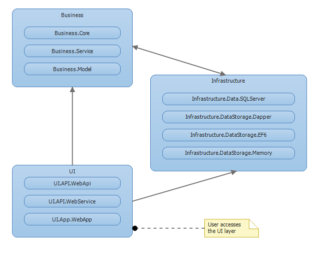
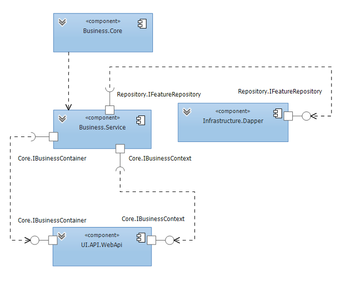

# E5R.Architecture.DotNet.One.VS2015

E5R Architecture Model One, for .NET in Visual Studio 2015

#### Architecture Layers

#### Architecture Components

## PT-BR

Arquitetura modelo "Um", para projetos .NET em Visual Studio 2015

### Tecnologias usadas

* Visual Studio 2015
* Node.js Tools 1.3
* SQL Server Data Tools
* Web Extension Pack 2015

#### Back-End

* .NET Framework 4.5.2
* SQL Server
* ASP.NET Web API
* ASP.NET Identity
* EntityFramework 6
* Dapper
* WCF
* Z.EntityFramework.Plus
* Swagger
* AutoMapper
* Owin
* Autofac

#### Front-End

* NodeJS/NPM
* Bower
* Grunt
* RequireJS
* AngularJS
* Angular UI
* Bootstrap
* Less